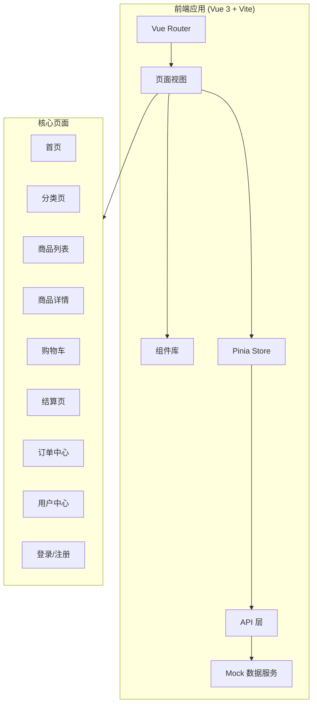
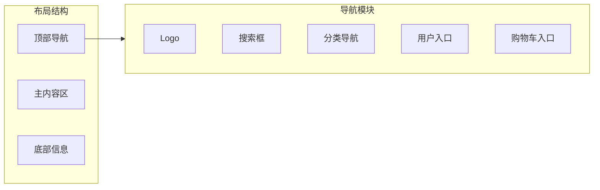
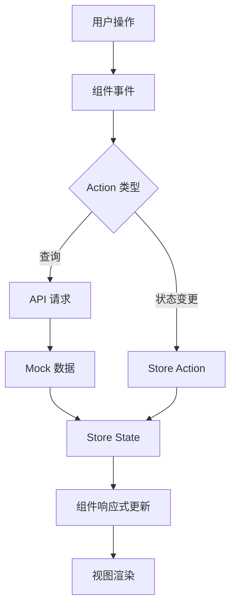

# 线上购物商城前端设计文档

## 1. 系统架构

## 2. 页面结构

## 3. 数据流设计

## 4. 核心模块

### 4.1 商品模块
- 商品列表展示（支持筛选、排序、分页）
- 商品详情（轮播图、规格选择、库存显示）
- 商品搜索（关键词、分类筛选）

### 4.2 购物车模块
- 添加/删除商品
- 修改数量
- 选择/全选商品
- 价格计算

### 4.3 订单模块
- 订单创建
- 订单列表
- 订单详情
- 订单状态跟踪

### 4.4 用户模块
- 登录/注册
- 个人信息
- 收货地址管理
- 收藏夹

## 5. UI/UX 规范

### 5.1 色彩体系
| 用途 | 色值 | 说明 |
|------|------|------|
| 主色 | #FF6B35 | 品牌橙色，用于按钮、高亮 |
| 辅助色 | #2D3436 | 深灰色，用于标题文字 |
| 背景色 | #F5F6FA | 浅灰背景 |
| 卡片背景 | #FFFFFF | 纯白卡片 |
| 边框色 | #E8E8E8 | 分割线、边框 |
| 成功色 | #52C41A | 成功状态 |
| 警告色 | #FAAD14 | 警告状态 |
| 错误色 | #FF4D4F | 错误状态 |
| 文字主色 | #2D3436 | 主要文字 |
| 文字次色 | #636E72 | 次要文字 |
| 文字弱色 | #B2BEC3 | 辅助文字 |

### 5.2 字体规范
- 标题字体：18px / 20px / 24px，font-weight: 600
- 正文字体：14px，font-weight: 400
- 辅助字体：12px，font-weight: 400
- 价格字体：16px / 20px，font-weight: 700，color: #FF6B35

### 5.3 间距规范
- 基础单位：8px
- 常用间距：8px / 12px / 16px / 24px / 32px
- 卡片内边距：16px / 20px
- 页面边距：24px

### 5.4 圆角规范
- 小圆角：4px（按钮、输入框）
- 中圆角：8px（卡片、弹窗）
- 大圆角：12px（特殊卡片）

### 5.5 阴影规范
- 卡片阴影：0 2px 12px rgba(0, 0, 0, 0.08)
- 悬浮阴影：0 4px 20px rgba(0, 0, 0, 0.12)
- 弹窗阴影：0 8px 32px rgba(0, 0, 0, 0.16)

## 6. 路由设计

| 路径 | 页面 | 说明 |
|------|------|------|
| / | Home | 首页 |
| /category | Category | 分类页 |
| /products | ProductList | 商品列表 |
| /product/:id | ProductDetail | 商品详情 |
| /cart | Cart | 购物车 |
| /checkout | Checkout | 结算页 |
| /orders | OrderList | 订单列表 |
| /order/:id | OrderDetail | 订单详情 |
| /user | UserCenter | 用户中心 |
| /user/address | AddressList | 地址管理 |
| /user/favorites | Favorites | 收藏夹 |
| /login | Login | 登录 |
| /register | Register | 注册 |

## 7. 组件清单

### 7.1 布局组件
- AppHeader - 顶部导航
- AppFooter - 底部信息
- AppSidebar - 侧边栏

### 7.2 业务组件
- ProductCard - 商品卡片
- ProductGrid - 商品网格
- CartItem - 购物车项
- OrderCard - 订单卡片
- AddressCard - 地址卡片
- CategoryNav - 分类导航

### 7.3 通用组件
- SearchBar - 搜索框
- ImageCarousel - 图片轮播
- QuantitySelector - 数量选择器
- PriceTag - 价格标签
- EmptyState - 空状态
- LoadingSpinner - 加载动画
